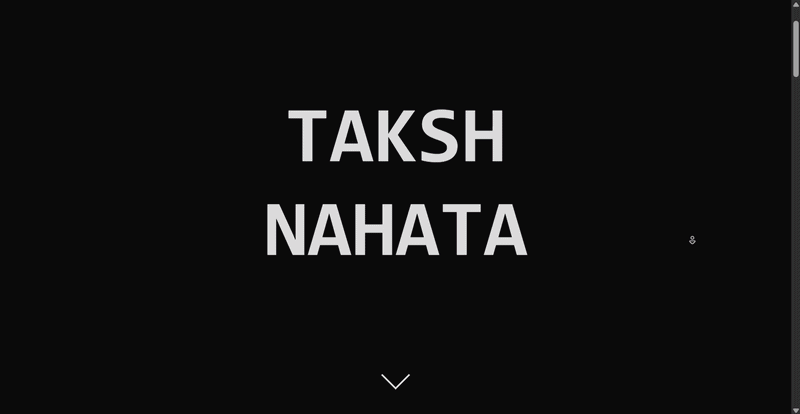

# TermiFolio (My Terminal Portfolio)

**Playable Demo Link:** [https://takshnahata.vercel.app/](https://takshnahata.vercel.app/)

## What is this?
I created an interactive, terminal-based personal portfolio website built entirely from scratch using HTML, CSS, and Vanilla JavaScript. When you visit the website, you are greeted by a custom 3D CSS animation and then as you keep scrolling you reach the terminal interface. You use that to navigate the site and run commands. On each page, there are different things you can learn about me and then you can also contact me using the form on my Contact Me page.

## Why did I make it?
Most personal portfolios I've seen online are pretty boring, standard templates. Everyone does the exact same thing. I wanted to build something completely different and unique to me, which is why I made it like an OS and people have to interact with a terminal that controls my website, rather than just scrolling and clicking buttons.

## How to use it (Live)
1. Visit the deployed link above!
2. You will see an intro animation. Scroll down until you hit the terminal.
3. Click the terminal input and type `help` to see a list of commands.
4. Type `about` to navigate to my background page.
5. Type `contact` to visit the messaging form.

P.S. You can click the buttons on the terminal to navigate as well if you don't want to type out the command!

## How to run it locally (Setup Instructions)
If you want to clone this and run it yourself:
1. Clone the repository: `git clone https://github.com/taksh-nahata/portfolio.git`
2. Since there is a backend component for the contact form, you need to install the dependencies. Run `npm install`.
3. To run the frontend locally, you can use any live server extension or python server (`python -m http.server 8000`).
4. To test the backend API locally, you'll need the Vercel CLI. Run `vercel dev`.
5. Open your browser to `http://localhost:3000` (or whatever port Vercel assigns).

## Project Structure
* `index.html`, `style.css`, `script.js` - The core frontend interface, 3D intro, and terminal logic. Basically the home page and default styles and scripts
* `/about/` - My biography page, including photos of myself.
* `/contact/` - The direct messaging form and socials
* `/api/contact.js` - Vercel Serverless Function that securely pushes form submissions into my Neon database.

## Screenshots
